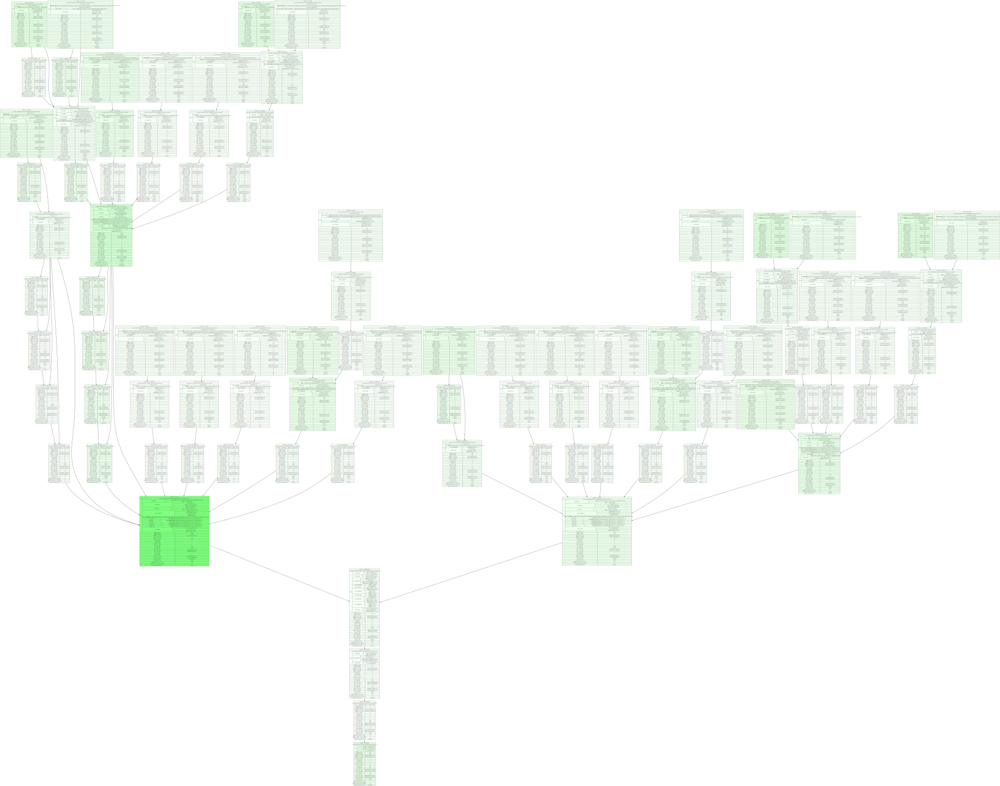

# bq_qplan_vis

BigQuery Query Plan Visualizer

Reads job execution info from BigQuery and produces a graph of the job stages. The job info can be saved as `DOT`, `SVG`, or `JSON`. `JSON` can be sent back through at a later date using `infile` or stdin. `DOT` output can be rendered to `SVG`, `JPEG`, `PNG`, etc. using the `dot` executable, available by installing graphviz. See [graphviz.org](https://graphviz.org/download/) for details. Internal rendering is handled by the graphviz library, which is embedded in this executable.

The display shows each stage in a shade of green. The brighter the green, the higher the `max_compute_ms_max`. The thickness of the lines between stages is determined by the number of output rows from the source stage. Thick lines and green stages tend to go together, but not always. Both are meant as a hint to the reader as to where they might look for the problem. Note that the output can be large. It is possible that your browser will start zoomed-in on some empty portion of the graph. Zoom out and scroll around.

## Usage

```text
Usage:
  bq_qplan_vis [infile] [flags]

Flags:
      --billing_project string   project to query from (for billing purposes). defaults to project value.
      --project string           project to query
      --region string            BigQuery region (default "region-us")
      --job_id string            id to query
      --json                     output data as JSON
      --dot                      output data as DOT
      --svg                      output data as SVG (default)
      --min_age duration         minimum age of the job (default 0)
      --max_age duration         maximum age of the job (default 12h0m0s)
  -h, --help                     help for bq_qplan_vis
```

If called with a project/job_id, the execution plan is queried. This can take a minute or two, so please be patient. This is based on the `INFORMATION_SCHEMA.JOBS_BY_PROJECT` table, which is paritioned by `creation_time`. To keep this lookup reasonable, the time range to search is defined by `--min_age` and `--max_age`. The range defaults to the previous 12 hours.

```bash
bq_qplan_vis \
    --project bluecore-serapian \
    --job_id Ocr2m1lxYN6l3nCQkGPbszGsbTaonZ_Ckbbr0CopfwXnGVYYi8UbbruTN4iUtzkaOCqsfMiitskUwXI2NbiNsux_8L_PpolFfj4V0dF_oVysABxe10AYKx8LaZEmRgncKz9_z7_cyQSecCrez15bb0Qmi4ImhCaYmTbjunWpSvkgnc_aZTlL_2ZziLze4pfpzOH0BUDWqOvp0jMqFaV_hmimjDC9w3a_XqvSJrLQsQka0stVX4dhrWX3RZE_rAtO > tmp/Ocr2m1lxYN6l3nCQkGPbszGsbTaonZ.svg
```

You can also pass in the JSON output from the query in as either a file or stdin:

```bash
bq_qplan_vis bq_job_RHPQ8hQLtgbvSAXcNJcwzkoy.json > tmp/bq_job_RHPQ8hQLtgbvSAXcNJcwzkoy.svg
```

or

```bash
cat bq_job_RHPQ8hQLtgbvSAXcNJcwzkoy.json | bq_qplan_vis > tmp/bq_job_RHPQ8hQLtgbvSAXcNJcwzkoy.svg
```

## Example



## Installation

Installing this tool is the same as installing any other Go tool. Assuming you have a recent version of Go installed, the following will install this tool:

````bash
go install github.com/TriggerMail/bq_qplan_vis@latest
````

While the application can output `svg`, `dot`, and `json` natively, you may want `dot` from graphviz to render `DOT` output to alternate formats. You may also want `rsvg-convert` to render `SVG` output into `PNG`, `JPEG`, etc. These can both installed via homebrew on a Mac.

```bash
brew install graphviz librsvg
```

Please proceed as directed to install on your platform.
